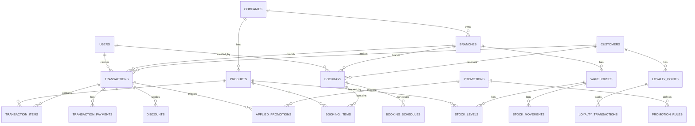

# 📊 Database Schema - Complete Documentation

Database schema untuk **POS-EXPO-MONOLITH** dirancang dengan fokus pada **transaction processing**, **inventory management**, **customer loyalty**, dan **booking system** dengan performa tinggi dan scalability.

---

## 📋 Table of Contents

1. [Overview](#overview)
2. [Core Entities](#core-entities)
3. [Relational Diagram](#relational-diagram)
4. [Table Specifications](#table-specifications)
5. [Indexes & Performance](#indexes--performance)
6. [Migration Scripts](#migration-scripts)
7. [Seeding Data](#seeding-data)
8. [Best Practices](#best-practices)

---

## Overview

### Technology Stack
- **Database Engine**: PostgreSQL 14+
- **ORM**: TypeORM / Prisma
- **Cache Layer**: Redis (for real-time inventory & session cache)
- **Transactions**: ACID-compliant with proper isolation levels

### Design Principles
✅ **Normalized Design** - Reduce data redundancy  
✅ **Temporal Data** - Soft deletes with `deleted_at`  
✅ **Audit Trail** - Track created_by, created_at, updated_at  
✅ **Multi-tenancy Ready** - Company/Branch support  
✅ **Offline Support** - Sync-friendly schema  

---

## Core Entities

### User & Authentication
- `users` - System users (cashier, admin, manager)
- `roles` - Role definitions (CASHIER, ADMIN, MANAGER, WAREHOUSE)
- `user_roles` - User-role mapping

### Products & Inventory
- `products` - Master product data
- `categories` - Product categories
- `product_images` - Product photos/images
- `warehouses` - Storage locations
- `stock_levels` - Real-time inventory per warehouse
- `stock_movements` - Inventory transaction history

### Transactions (POS)
- `transactions` - Sales transactions header
- `transaction_items` - Line items per transaction
- `transaction_payments` - Payment methods per transaction
- `discounts` - Applied discounts
- `cash_register_sessions` - Kasir opening/closing

### Customers & Loyalty
- `customers` - Customer master data
- `customer_contacts` - Customer contact information
- `loyalty_points` - Points balance per customer
- `loyalty_transactions` - Points earn/redeem history
- `customer_price_lists` - Custom pricing per customer

### Promotions & Rules
- `promotions` - Promotion/campaign master
- `promotion_rules` - Discount rules (BOGO, % off, min purchase)
- `promotion_conditions` - Conditions for promotion
- `applied_promotions` - Audit trail of applied promotions

### Bookings & Reservations
- `bookings` - Booking/reservation master
- `booking_items` - Products in booking
- `booking_schedules` - Schedule/timeslot for booking

### Multi-Store Management
- `companies` - Parent company/organization
- `branches` - Physical store locations
- `branch_warehouses` - Warehouse assignments

### Reports & Analytics
- `sales_daily_summary` - Daily aggregated sales (materialized view)
- `inventory_movement_log` - Historical inventory changes
- `sales_reports` - Ad-hoc sales analytics

---

## Relational Diagram

```
┌─────────────────────────────────────────────────────────────┐
│                     CORE USER MANAGEMENT                     │
├─────────────────────────────────────────────────────────────┤
│  users (id, username, email, password_hash, role_id, ...)   │
│         ↓                                                     │
│  roles (id, name, permissions, ...)                          │
└─────────────────────────────────────────────────────────────┘

┌─────────────────────────────────────────────────────────────┐
│              MULTI-STORE ORGANIZATION                        │
├─────────────────────────────────────────────────────────────┤
│  companies (id, name, legal_name, ...)                       │
│         ↓                                                     │
│  branches (id, company_id, name, location, ...)              │
│         ↓                                                     │
│  warehouses (id, branch_id, name, location_type, ...)        │
└─────────────────────────────────────────────────────────────┘

┌─────────────────────────────────────────────────────────────┐
│                PRODUCTS & INVENTORY                          │
├─────────────────────────────────────────────────────────────┤
│  products (id, sku, name, category_id, ...)                  │
│         ↓                ↓                                    │
│  categories             stock_levels (product_id,            │
│                         warehouse_id, qty, ...)              │
│  product_images                                              │
└─────────────────────────────────────────────────────────────┘

┌─────────────────────────────────────────────────────────────┐
│              TRANSACTION (SALES) PROCESSING                  │
├─────────────────────────────────────────────────────────────┤
│  transactions (id, branch_id, cashier_id, total, ...)        │
│         ↓         ↓                                           │
│  transaction_items  cash_register_sessions                   │
│         ↓                                                     │
│  transaction_payments                                        │
│         ↓                                                     │
│  discounts (transaction_id, reason, amount)                  │
└─────────────────────────────────────────────────────────────┘

┌─────────────────────────────────────────────────────────────┐
│              CUSTOMER & LOYALTY MANAGEMENT                   │
├─────────────────────────────────────────────────────────────┤
│  customers (id, phone, name, customer_category, ...)         │
│         ↓                                                     │
│  customer_contacts                                           │
│  loyalty_points (customer_id, balance, tier, ...)            │
│         ↓                                                     │
│  loyalty_transactions (earn/redeem history)                  │
│  customer_price_lists (custom pricing)                       │
└─────────────────────────────────────────────────────────────┘

┌─────────────────────────────────────────────────────────────┐
│              PROMOTIONS & DISCOUNT RULES                     │
├─────────────────────────────────────────────────────────────┤
│  promotions (id, name, type, valid_from, valid_to, ...)      │
│         ↓                                                     │
│  promotion_rules (promotion_id, rule_type, ...)              │
│         ↓                                                     │
│  promotion_conditions (condition_type, value, ...)           │
│  applied_promotions (audit trail)                            │
└─────────────────────────────────────────────────────────────┘

┌─────────────────────────────────────────────────────────────┐
│                BOOKING & RESERVATIONS                        │
├─────────────────────────────────────────────────────────────┤
│  bookings (id, customer_id, status, booking_date, ...)       │
│         ↓                                                     │
│  booking_items (booking_id, product_id, qty, ...)            │
│         ↓                                                     │
│  booking_schedules (booking_id, date, time_slot, ...)        │
└─────────────────────────────────────────────────────────────┘
```

---

## Table Specifications

### 1. USERS & AUTHENTICATION

#### `users`
```sql
CREATE TABLE users (
  id UUID PRIMARY KEY DEFAULT gen_random_uuid(),
  username VARCHAR(50) NOT NULL UNIQUE,
  email VARCHAR(100) NOT NULL UNIQUE,
  password_hash VARCHAR(255) NOT NULL,
  
  -- Profile
  full_name VARCHAR(100) NOT NULL,
  phone_number VARCHAR(20),
  avatar_url VARCHAR(500),
  
  -- Role & Permissions
  role_id UUID NOT NULL REFERENCES roles(id),
  branch_id UUID REFERENCES branches(id),
  
  -- Status
  is_active BOOLEAN DEFAULT TRUE,
  last_login_at TIMESTAMP,
  
  -- Audit
  created_at TIMESTAMP DEFAULT CURRENT_TIMESTAMP,
  updated_at TIMESTAMP DEFAULT CURRENT_TIMESTAMP,
  created_by UUID,
  deleted_at TIMESTAMP,
  
  CHECK (email ~ '^[A-Za-z0-9._%+-]+@[A-Za-z0-9.-]+\.[A-Z|a-z]{2,}$')
);

CREATE INDEX idx_users_username ON users(username);
CREATE INDEX idx_users_email ON users(email);
CREATE INDEX idx_users_branch_id ON users(branch_id) WHERE deleted_at IS NULL;
CREATE INDEX idx_users_is_active ON users(is_active) WHERE deleted_at IS NULL;
```

#### `roles`
```sql
CREATE TABLE roles (
  id UUID PRIMARY KEY DEFAULT gen_random_uuid(),
  name VARCHAR(50) NOT NULL UNIQUE,
  description TEXT,
  
  permissions JSONB NOT NULL DEFAULT '{}',
  -- Example: {"transactions:create":true,"inventory:read":true}
  
  is_system BOOLEAN DEFAULT FALSE, -- System roles (CASHIER, ADMIN, etc)
  
  created_at TIMESTAMP DEFAULT CURRENT_TIMESTAMP,
  updated_at TIMESTAMP DEFAULT CURRENT_TIMESTAMP,
  
  UNIQUE(name)
);

INSERT INTO roles (name, permissions, is_system) VALUES
('ADMIN', '{"*":true}'::jsonb, TRUE),
('MANAGER', '{"transactions:*":true,"inventory:*":true,"reports:*":true,"customers:*":true}'::jsonb, TRUE),
('CASHIER', '{"transactions:create":true,"inventory:read":true,"customers:read":true}'::jsonb, TRUE),
('WAREHOUSE_STAFF', '{"inventory:*":true,"stock_movement:*":true}'::jsonb, TRUE);
```

---

### 2. ORGANIZATION & MULTI-STORE

#### `companies`
```sql
CREATE TABLE companies (
  id UUID PRIMARY KEY DEFAULT gen_random_uuid(),
  name VARCHAR(150) NOT NULL,
  legal_name VARCHAR(200),
  tax_id VARCHAR(50),
  
  -- Address
  address VARCHAR(255),
  city VARCHAR(50),
  province VARCHAR(50),
  country VARCHAR(50) DEFAULT 'Indonesia',
  postal_code VARCHAR(10),
  
  -- Contact
  phone_number VARCHAR(20),
  email VARCHAR(100),
  website VARCHAR(200),
  
  -- Settings
  currency_code VARCHAR(3) DEFAULT 'IDR',
  timezone VARCHAR(50) DEFAULT 'Asia/Jakarta',
  locale VARCHAR(10) DEFAULT 'id_ID',
  
  is_active BOOLEAN DEFAULT TRUE,
  logo_url VARCHAR(500),
  
  created_at TIMESTAMP DEFAULT CURRENT_TIMESTAMP,
  updated_at TIMESTAMP DEFAULT CURRENT_TIMESTAMP,
  created_by UUID,
  deleted_at TIMESTAMP
);

CREATE INDEX idx_companies_active ON companies(is_active) WHERE deleted_at IS NULL;
```

#### `branches`
```sql
CREATE TABLE branches (
  id UUID PRIMARY KEY DEFAULT gen_random_uuid(),
  company_id UUID NOT NULL REFERENCES companies(id),
  
  name VARCHAR(150) NOT NULL,
  code VARCHAR(50) UNIQUE,
  
  -- Address
  address VARCHAR(255),
  city VARCHAR(50),
  latitude DECIMAL(10, 8),
  longitude DECIMAL(11, 8),
  
  -- Contact
  phone_number VARCHAR(20),
  email VARCHAR(100),
  
  -- Settings
  opening_time TIME,
  closing_time TIME,
  
  manager_id UUID REFERENCES users(id),
  
  is_active BOOLEAN DEFAULT TRUE,
  
  created_at TIMESTAMP DEFAULT CURRENT_TIMESTAMP,
  updated_at TIMESTAMP DEFAULT CURRENT_TIMESTAMP,
  created_by UUID,
  deleted_at TIMESTAMP
);

CREATE INDEX idx_branches_company_id ON branches(company_id);
CREATE INDEX idx_branches_code ON branches(code) WHERE deleted_at IS NULL;
CREATE INDEX idx_branches_active ON branches(is_active) WHERE deleted_at IS NULL;
```

#### `warehouses`
```sql
CREATE TABLE warehouses (
  id UUID PRIMARY KEY DEFAULT gen_random_uuid(),
  branch_id UUID NOT NULL REFERENCES branches(id),
  company_id UUID NOT NULL REFERENCES companies(id),
  
  name VARCHAR(150) NOT NULL,
  code VARCHAR(50) UNIQUE,
  location_type VARCHAR(20), -- 'MAIN_STORE', 'BACKROOM', 'WAREHOUSE'
  
  address VARCHAR(255),
  phone_number VARCHAR(20),
  
  manager_id UUID REFERENCES users(id),
  
  is_active BOOLEAN DEFAULT TRUE,
  
  created_at TIMESTAMP DEFAULT CURRENT_TIMESTAMP,
  updated_at TIMESTAMP DEFAULT CURRENT_TIMESTAMP,
  deleted_at TIMESTAMP
);

CREATE INDEX idx_warehouses_branch_id ON warehouses(branch_id);
CREATE INDEX idx_warehouses_code ON warehouses(code) WHERE deleted_at IS NULL;
```

---

### 3. PRODUCTS & INVENTORY

#### `categories`
```sql
CREATE TABLE categories (
  id UUID PRIMARY KEY DEFAULT gen_random_uuid(),
  company_id UUID NOT NULL REFERENCES companies(id),
  
  name VARCHAR(100) NOT NULL,
  slug VARCHAR(100),
  description TEXT,
  
  parent_category_id UUID REFERENCES categories(id), -- For subcategories
  
  display_order INTEGER DEFAULT 0,
  is_active BOOLEAN DEFAULT TRUE,
  
  created_at TIMESTAMP DEFAULT CURRENT_TIMESTAMP,
  updated_at TIMESTAMP DEFAULT CURRENT_TIMESTAMP,
  deleted_at TIMESTAMP
);

CREATE INDEX idx_categories_company_id ON categories(company_id);
CREATE INDEX idx_categories_parent ON categories(parent_category_id);
```

#### `products`
```sql
CREATE TABLE products (
  id UUID PRIMARY KEY DEFAULT gen_random_uuid(),
  company_id UUID NOT NULL REFERENCES companies(id),
  category_id UUID NOT NULL REFERENCES categories(id),
  
  -- Product Basics
  sku VARCHAR(50) NOT NULL,
  barcode VARCHAR(50),
  name VARCHAR(200) NOT NULL,
  description TEXT,
  
  -- Pricing
  base_price DECIMAL(15, 2) NOT NULL,
  cost_price DECIMAL(15, 2),
  min_price DECIMAL(15, 2), -- For discount floor
  
  -- Physical Properties
  unit_of_measure VARCHAR(20), -- 'PCS', 'BOX', 'LITER', etc
  weight_in_kg DECIMAL(10, 3),
  
  -- Status & Control
  is_active BOOLEAN DEFAULT TRUE,
  track_inventory BOOLEAN DEFAULT TRUE,
  allow_oversell BOOLEAN DEFAULT FALSE,
  
  -- Expiry Management
  has_expiry_date BOOLEAN DEFAULT FALSE,
  reorder_point INTEGER DEFAULT 0,
  
  -- Metadata
  supplier_id UUID, -- Can reference supplier if we have supplier table
  
  created_at TIMESTAMP DEFAULT CURRENT_TIMESTAMP,
  updated_at TIMESTAMP DEFAULT CURRENT_TIMESTAMP,
  created_by UUID,
  deleted_at TIMESTAMP
);

CREATE UNIQUE INDEX idx_products_company_sku ON products(company_id, sku) WHERE deleted_at IS NULL;
CREATE INDEX idx_products_category ON products(category_id);
CREATE INDEX idx_products_active ON products(is_active) WHERE deleted_at IS NULL;
CREATE INDEX idx_products_barcode ON products(barcode) WHERE barcode IS NOT NULL;
```

#### `product_images`
```sql
CREATE TABLE product_images (
  id UUID PRIMARY KEY DEFAULT gen_random_uuid(),
  product_id UUID NOT NULL REFERENCES products(id) ON DELETE CASCADE,
  
  image_url VARCHAR(500) NOT NULL,
  display_order INTEGER DEFAULT 0,
  is_primary BOOLEAN DEFAULT FALSE,
  
  created_at TIMESTAMP DEFAULT CURRENT_TIMESTAMP
);

CREATE INDEX idx_product_images_product_id ON product_images(product_id);
```

#### `stock_levels`
```sql
CREATE TABLE stock_levels (
  id UUID PRIMARY KEY DEFAULT gen_random_uuid(),
  product_id UUID NOT NULL REFERENCES products(id),
  warehouse_id UUID NOT NULL REFERENCES warehouses(id),
  company_id UUID NOT NULL REFERENCES companies(id),
  
  quantity_on_hand INTEGER NOT NULL DEFAULT 0, -- Physical stock
  quantity_reserved INTEGER NOT NULL DEFAULT 0, -- Reserved for orders/bookings
  quantity_available INTEGER GENERATED ALWAYS AS 
    (quantity_on_hand - quantity_reserved) STORED,
  
  -- Last count
  last_count_date TIMESTAMP,
  last_count_qty INTEGER,
  
  created_at TIMESTAMP DEFAULT CURRENT_TIMESTAMP,
  updated_at TIMESTAMP DEFAULT CURRENT_TIMESTAMP,
  
  UNIQUE(product_id, warehouse_id),
  CHECK (quantity_on_hand >= 0),
  CHECK (quantity_reserved >= 0)
);

CREATE INDEX idx_stock_levels_warehouse ON stock_levels(warehouse_id);
CREATE INDEX idx_stock_levels_product ON stock_levels(product_id);
CREATE INDEX idx_stock_levels_available ON stock_levels(quantity_available);
```

#### `stock_movements`
```sql
CREATE TABLE stock_movements (
  id UUID PRIMARY KEY DEFAULT gen_random_uuid(),
  product_id UUID NOT NULL REFERENCES products(id),
  warehouse_id UUID NOT NULL REFERENCES warehouses(id),
  company_id UUID NOT NULL REFERENCES companies(id),
  branch_id UUID NOT NULL REFERENCES branches(id),
  
  movement_type VARCHAR(50) NOT NULL, 
  -- 'PURCHASE', 'SALES', 'RETURN', 'ADJUSTMENT', 'TRANSFER', 'DAMAGE', 'EXPIRY'
  
  quantity_change INTEGER NOT NULL, -- Positive or negative
  reference_type VARCHAR(50), -- 'TRANSACTION', 'BOOKING', 'TRANSFER', etc
  reference_id UUID, -- Link to transaction, booking, etc
  
  notes TEXT,
  
  created_by UUID NOT NULL REFERENCES users(id),
  created_at TIMESTAMP DEFAULT CURRENT_TIMESTAMP
);

CREATE INDEX idx_stock_movements_product ON stock_movements(product_id);
CREATE INDEX idx_stock_movements_warehouse ON stock_movements(warehouse_id);
CREATE INDEX idx_stock_movements_movement_type ON stock_movements(movement_type);
CREATE INDEX idx_stock_movements_reference ON stock_movements(reference_type, reference_id);
CREATE INDEX idx_stock_movements_created_at ON stock_movements(created_at);
```

---

### 4. TRANSACTIONS (POS)

#### `cash_register_sessions`
```sql
CREATE TABLE cash_register_sessions (
  id UUID PRIMARY KEY DEFAULT gen_random_uuid(),
  branch_id UUID NOT NULL REFERENCES branches(id),
  cashier_id UUID NOT NULL REFERENCES users(id),
  
  -- Session Details
  session_number INTEGER NOT NULL, -- Auto-increment per branch per day
  opened_at TIMESTAMP NOT NULL DEFAULT CURRENT_TIMESTAMP,
  closed_at TIMESTAMP,
  
  -- Opening & Closing
  opening_balance DECIMAL(15, 2) NOT NULL,
  expected_closing_balance DECIMAL(15, 2),
  actual_closing_balance DECIMAL(15, 2),
  difference DECIMAL(15, 2), -- variance = actual - expected
  
  -- Status
  is_closed BOOLEAN DEFAULT FALSE,
  
  notes TEXT,
  
  created_at TIMESTAMP DEFAULT CURRENT_TIMESTAMP,
  updated_at TIMESTAMP DEFAULT CURRENT_TIMESTAMP
);

CREATE INDEX idx_cash_sessions_cashier ON cash_register_sessions(cashier_id);
CREATE INDEX idx_cash_sessions_branch ON cash_register_sessions(branch_id);
CREATE INDEX idx_cash_sessions_opened_at ON cash_register_sessions(opened_at);
CREATE INDEX idx_cash_sessions_not_closed ON cash_register_sessions(is_closed) WHERE is_closed = FALSE;
```

#### `transactions`
```sql
CREATE TABLE transactions (
  id UUID PRIMARY KEY DEFAULT gen_random_uuid(),
  receipt_number VARCHAR(50) NOT NULL UNIQUE, -- Format: BR-20260601-0001
  
  -- Organization
  company_id UUID NOT NULL REFERENCES companies(id),
  branch_id UUID NOT NULL REFERENCES branches(id),
  warehouse_id UUID NOT NULL REFERENCES warehouses(id),
  
  -- Staff
  cashier_id UUID NOT NULL REFERENCES users(id),
  cash_register_session_id UUID NOT NULL REFERENCES cash_register_sessions(id),
  
  -- Customer
  customer_id UUID REFERENCES customers(id), -- Nullable for walk-in customers
  
  -- Amounts
  subtotal DECIMAL(15, 2) NOT NULL DEFAULT 0,
  discount_amount DECIMAL(15, 2) DEFAULT 0,
  tax_amount DECIMAL(15, 2) DEFAULT 0,
  total_amount DECIMAL(15, 2) NOT NULL,
  amount_paid DECIMAL(15, 2),
  change_amount DECIMAL(15, 2),
  
  -- Transaction Details
  transaction_type VARCHAR(20) DEFAULT 'SALES', -- SALES, RETURN, EXCHANGE
  status VARCHAR(20) DEFAULT 'COMPLETED', -- PENDING, COMPLETED, CANCELLED
  notes TEXT,
  
  -- On-Hold / Parking
  is_held BOOLEAN DEFAULT FALSE,
  held_at TIMESTAMP,
  held_duration_minutes INTEGER,
  
  -- Timestamps
  transaction_at TIMESTAMP NOT NULL DEFAULT CURRENT_TIMESTAMP,
  created_at TIMESTAMP DEFAULT CURRENT_TIMESTAMP,
  updated_at TIMESTAMP DEFAULT CURRENT_TIMESTAMP,
  created_by UUID,
  cancelled_at TIMESTAMP,
  cancelled_reason TEXT,
  
  CHECK (total_amount >= 0),
  CHECK (amount_paid >= 0)
);

CREATE UNIQUE INDEX idx_transactions_receipt ON transactions(receipt_number);
CREATE INDEX idx_transactions_branch_date ON transactions(branch_id, transaction_at);
CREATE INDEX idx_transactions_customer ON transactions(customer_id) WHERE customer_id IS NOT NULL;
CREATE INDEX idx_transactions_cashier ON transactions(cashier_id);
CREATE INDEX idx_transactions_status ON transactions(status);
CREATE INDEX idx_transactions_is_held ON transactions(is_held) WHERE is_held = TRUE;
CREATE INDEX idx_transactions_transaction_at ON transactions(transaction_at);
```

#### `transaction_items`
```sql
CREATE TABLE transaction_items (
  id UUID PRIMARY KEY DEFAULT gen_random_uuid(),
  transaction_id UUID NOT NULL REFERENCES transactions(id) ON DELETE CASCADE,
  product_id UUID NOT NULL REFERENCES products(id),
  
  -- Quantity & Pricing
  quantity INTEGER NOT NULL,
  unit_price DECIMAL(15, 2) NOT NULL, -- Price at time of sale
  subtotal DECIMAL(15, 2) NOT NULL, -- quantity * unit_price
  
  -- Discounts
  discount_percent DECIMAL(5, 2) DEFAULT 0,
  discount_amount DECIMAL(15, 2) DEFAULT 0,
  line_total DECIMAL(15, 2) NOT NULL, -- subtotal - discount_amount
  
  -- Notes
  notes TEXT,
  
  line_number INTEGER,
  
  created_at TIMESTAMP DEFAULT CURRENT_TIMESTAMP,
  
  CHECK (quantity > 0),
  CHECK (unit_price >= 0),
  CHECK (discount_percent >= 0 AND discount_percent <= 100)
);

CREATE INDEX idx_transaction_items_transaction ON transaction_items(transaction_id);
CREATE INDEX idx_transaction_items_product ON transaction_items(product_id);
```

#### `transaction_payments`
```sql
CREATE TABLE transaction_payments (
  id UUID PRIMARY KEY DEFAULT gen_random_uuid(),
  transaction_id UUID NOT NULL REFERENCES transactions(id) ON DELETE CASCADE,
  
  payment_method VARCHAR(50) NOT NULL, 
  -- 'CASH', 'CARD', 'QRIS', 'TRANSFER', 'POINTS', 'MIXED'
  
  amount DECIMAL(15, 2) NOT NULL,
  reference_number VARCHAR(100), -- For bank transfer, card transaction, QRIS ID
  
  payment_gateway VARCHAR(50), -- 'MIDTRANS', 'VERIFONE', etc (if applicable)
  gateway_response JSONB, -- Store full response from payment gateway
  
  status VARCHAR(20) DEFAULT 'SUCCESS', -- SUCCESS, PENDING, FAILED, CANCELLED
  
  created_at TIMESTAMP DEFAULT CURRENT_TIMESTAMP,
  
  CHECK (amount > 0)
);

CREATE INDEX idx_transaction_payments_transaction ON transaction_payments(transaction_id);
CREATE INDEX idx_transaction_payments_method ON transaction_payments(payment_method);
CREATE INDEX idx_transaction_payments_status ON transaction_payments(status);
```

#### `discounts`
```sql
CREATE TABLE discounts (
  id UUID PRIMARY KEY DEFAULT gen_random_uuid(),
  transaction_id UUID NOT NULL REFERENCES transactions(id) ON DELETE CASCADE,
  
  discount_type VARCHAR(50) NOT NULL, 
  -- 'MANUAL', 'PROMOTION', 'LOYALTY', 'EMPLOYEE', 'CUSTOMER_CATEGORY'
  
  reason TEXT,
  discount_amount DECIMAL(15, 2) NOT NULL,
  discount_percent DECIMAL(5, 2),
  
  promotion_id UUID REFERENCES promotions(id),
  applied_by_user_id UUID REFERENCES users(id),
  
  created_at TIMESTAMP DEFAULT CURRENT_TIMESTAMP,
  
  CHECK (discount_amount >= 0)
);

CREATE INDEX idx_discounts_transaction ON discounts(transaction_id);
CREATE INDEX idx_discounts_promotion ON discounts(promotion_id);
```

---

### 5. CUSTOMERS & LOYALTY

#### `customers`
```sql
CREATE TABLE customers (
  id UUID PRIMARY KEY DEFAULT gen_random_uuid(),
  company_id UUID NOT NULL REFERENCES companies(id),
  
  -- Identification
  customer_code VARCHAR(50) UNIQUE,
  phone_number VARCHAR(20) UNIQUE NOT NULL,
  email VARCHAR(100) UNIQUE,
  
  -- Profile
  first_name VARCHAR(100),
  last_name VARCHAR(100),
  full_name VARCHAR(200),
  
  -- Segmentation
  customer_category VARCHAR(50), -- 'RETAIL', 'WHOLESALE', 'VIP', etc
  customer_type VARCHAR(20), -- 'INDIVIDUAL', 'CORPORATE'
  
  -- Address
  address VARCHAR(255),
  city VARCHAR(50),
  province VARCHAR(50),
  postal_code VARCHAR(10),
  
  -- Business Info (if corporate)
  company_name VARCHAR(150),
  tax_id VARCHAR(50),
  
  -- Contact
  contact_person VARCHAR(100),
  alternate_phone VARCHAR(20),
  
  -- Preferences
  preferred_payment_method VARCHAR(50),
  
  -- Status
  is_active BOOLEAN DEFAULT TRUE,
  is_blacklisted BOOLEAN DEFAULT FALSE,
  blacklist_reason TEXT,
  
  -- Metadata
  photo_url VARCHAR(500),
  notes TEXT,
  
  -- Timestamps
  first_purchase_date TIMESTAMP,
  last_purchase_date TIMESTAMP,
  total_purchases INTEGER DEFAULT 0,
  total_spent DECIMAL(15, 2) DEFAULT 0,
  
  created_at TIMESTAMP DEFAULT CURRENT_TIMESTAMP,
  updated_at TIMESTAMP DEFAULT CURRENT_TIMESTAMP,
  created_by UUID,
  deleted_at TIMESTAMP
);

CREATE INDEX idx_customers_phone ON customers(phone_number) WHERE deleted_at IS NULL;
CREATE INDEX idx_customers_email ON customers(email) WHERE deleted_at IS NULL;
CREATE INDEX idx_customers_category ON customers(customer_category);
CREATE INDEX idx_customers_company ON customers(company_id);
CREATE INDEX idx_customers_active ON customers(is_active) WHERE deleted_at IS NULL;
```

#### `customer_contacts`
```sql
CREATE TABLE customer_contacts (
  id UUID PRIMARY KEY DEFAULT gen_random_uuid(),
  customer_id UUID NOT NULL REFERENCES customers(id) ON DELETE CASCADE,
  
  contact_type VARCHAR(50), -- 'PHONE', 'EMAIL', 'ADDRESS'
  contact_value VARCHAR(200) NOT NULL,
  
  is_primary BOOLEAN DEFAULT FALSE,
  
  created_at TIMESTAMP DEFAULT CURRENT_TIMESTAMP
);

CREATE INDEX idx_customer_contacts_customer ON customer_contacts(customer_id);
```

#### `loyalty_programs`
```sql
CREATE TABLE loyalty_programs (
  id UUID PRIMARY KEY DEFAULT gen_random_uuid(),
  company_id UUID NOT NULL REFERENCES companies(id),
  
  name VARCHAR(100) NOT NULL,
  description TEXT,
  
  -- Point Earning Rules
  points_per_purchase DECIMAL(5, 2), -- Points earned per IDR 1000 spent
  
  -- Point Redemption
  points_per_reward DECIMAL(5, 2), -- Minimum points to redeem
  reward_amount DECIMAL(15, 2), -- Amount of discount per redemption
  
  -- Tiers
  tier_structure JSONB, -- Define tier levels
  
  is_active BOOLEAN DEFAULT TRUE,
  
  created_at TIMESTAMP DEFAULT CURRENT_TIMESTAMP,
  updated_at TIMESTAMP DEFAULT CURRENT_TIMESTAMP
);
```

#### `loyalty_points`
```sql
CREATE TABLE loyalty_points (
  id UUID PRIMARY KEY DEFAULT gen_random_uuid(),
  customer_id UUID NOT NULL REFERENCES customers(id) ON DELETE CASCADE,
  company_id UUID NOT NULL REFERENCES companies(id),
  loyalty_program_id UUID NOT NULL REFERENCES loyalty_programs(id),
  
  -- Balance
  total_points DECIMAL(10, 2) DEFAULT 0,
  redeemable_points DECIMAL(10, 2) DEFAULT 0,
  expired_points DECIMAL(10, 2) DEFAULT 0,
  
  -- Tier
  current_tier VARCHAR(50), -- 'SILVER', 'GOLD', 'PLATINUM'
  
  last_updated_at TIMESTAMP,
  created_at TIMESTAMP DEFAULT CURRENT_TIMESTAMP
);

CREATE UNIQUE INDEX idx_loyalty_points_customer ON loyalty_points(customer_id, loyalty_program_id);
```

#### `loyalty_transactions`
```sql
CREATE TABLE loyalty_transactions (
  id UUID PRIMARY KEY DEFAULT gen_random_uuid(),
  customer_id UUID NOT NULL REFERENCES customers(id),
  loyalty_points_id UUID NOT NULL REFERENCES loyalty_points(id),
  
  transaction_type VARCHAR(50), -- 'EARN', 'REDEEM', 'EXPIRE', 'ADJUSTMENT'
  points_amount DECIMAL(10, 2) NOT NULL,
  reference_id UUID, -- Link to transaction/booking
  
  notes TEXT,
  
  created_by UUID REFERENCES users(id),
  created_at TIMESTAMP DEFAULT CURRENT_TIMESTAMP
);

CREATE INDEX idx_loyalty_transactions_customer ON loyalty_transactions(customer_id);
CREATE INDEX idx_loyalty_transactions_type ON loyalty_transactions(transaction_type);
```

#### `customer_price_lists`
```sql
CREATE TABLE customer_price_lists (
  id UUID PRIMARY KEY DEFAULT gen_random_uuid(),
  customer_id UUID REFERENCES customers(id),
  customer_category_id UUID, -- Apply to category of customers
  company_id UUID NOT NULL REFERENCES companies(id),
  
  -- Pricing Strategy
  pricing_type VARCHAR(50), -- 'PERCENTAGE_DISCOUNT', 'FIXED_PRICE'
  
  -- Rules
  price_rules JSONB, -- Array of {product_id, discount_percent, price}
  
  valid_from TIMESTAMP,
  valid_until TIMESTAMP,
  
  is_active BOOLEAN DEFAULT TRUE,
  
  created_at TIMESTAMP DEFAULT CURRENT_TIMESTAMP,
  updated_at TIMESTAMP DEFAULT CURRENT_TIMESTAMP
);

CREATE INDEX idx_customer_price_lists_customer ON customer_price_lists(customer_id);
```

---

### 6. PROMOTIONS & DISCOUNT RULES

#### `promotions`
```sql
CREATE TABLE promotions (
  id UUID PRIMARY KEY DEFAULT gen_random_uuid(),
  company_id UUID NOT NULL REFERENCES companies(id),
  
  -- Basic Info
  name VARCHAR(200) NOT NULL,
  description TEXT,
  
  promotion_type VARCHAR(50) NOT NULL,
  -- 'PERCENTAGE_DISCOUNT', 'FIXED_AMOUNT', 'BOGO', 'FREE_ITEM', 'BUNDLE'
  
  -- Validity
  valid_from TIMESTAMP NOT NULL,
  valid_until TIMESTAMP NOT NULL,
  
  -- Scope
  applicable_branches JSONB, -- NULL = all branches
  applicable_products JSONB, -- NULL = all products
  applicable_customer_categories JSONB, -- NULL = all customers
  
  -- Limits
  max_discount_per_transaction DECIMAL(15, 2),
  max_redemptions_per_customer INTEGER,
  max_redemptions_total INTEGER,
  current_redemptions INTEGER DEFAULT 0,
  
  -- Status
  is_active BOOLEAN DEFAULT TRUE,
  priority INTEGER DEFAULT 100, -- Lower = higher priority
  
  -- Metadata
  promotional_image_url VARCHAR(500),
  
  created_at TIMESTAMP DEFAULT CURRENT_TIMESTAMP,
  updated_at TIMESTAMP DEFAULT CURRENT_TIMESTAMP,
  created_by UUID,
  deleted_at TIMESTAMP
);

CREATE INDEX idx_promotions_active ON promotions(is_active) WHERE deleted_at IS NULL;
CREATE INDEX idx_promotions_validity ON promotions(valid_from, valid_until);
CREATE INDEX idx_promotions_priority ON promotions(priority);
```

#### `promotion_rules`
```sql
CREATE TABLE promotion_rules (
  id UUID PRIMARY KEY DEFAULT gen_random_uuid(),
  promotion_id UUID NOT NULL REFERENCES promotions(id) ON DELETE CASCADE,
  
  rule_type VARCHAR(50) NOT NULL,
  -- 'MINIMUM_PURCHASE', 'PRODUCT_CATEGORY', 'QUANTITY', 'PAYMENT_METHOD'
  
  -- Discount Details
  discount_type VARCHAR(50), -- 'PERCENTAGE', 'FIXED_AMOUNT', 'FREE_ITEM'
  discount_value DECIMAL(10, 2),
  
  -- Condition Details
  condition_value JSONB, -- Store complex condition values
  
  -- For BOGO/Free Item
  free_product_id UUID REFERENCES products(id),
  free_quantity INTEGER,
  
  display_order INTEGER DEFAULT 0,
  
  created_at TIMESTAMP DEFAULT CURRENT_TIMESTAMP
);

CREATE INDEX idx_promotion_rules_promotion ON promotion_rules(promotion_id);
```

#### `applied_promotions`
```sql
CREATE TABLE applied_promotions (
  id UUID PRIMARY KEY DEFAULT gen_random_uuid(),
  transaction_id UUID NOT NULL REFERENCES transactions(id) ON DELETE CASCADE,
  promotion_id UUID NOT NULL REFERENCES promotions(id),
  
  discount_amount DECIMAL(15, 2) NOT NULL,
  applied_at TIMESTAMP DEFAULT CURRENT_TIMESTAMP
);

CREATE INDEX idx_applied_promotions_transaction ON applied_promotions(transaction_id);
CREATE INDEX idx_applied_promotions_promotion ON applied_promotions(promotion_id);
```

---

### 7. BOOKINGS & RESERVATIONS

#### `bookings`
```sql
CREATE TABLE bookings (
  id UUID PRIMARY KEY DEFAULT gen_random_uuid(),
  company_id UUID NOT NULL REFERENCES companies(id),
  branch_id UUID NOT NULL REFERENCES branches(id),
  
  booking_code VARCHAR(50) UNIQUE NOT NULL,
  
  -- Customer
  customer_id UUID NOT NULL REFERENCES customers(id),
  
  -- Booking Details
  booking_status VARCHAR(50) DEFAULT 'PENDING',
  -- 'PENDING', 'CONFIRMED', 'IN_PROGRESS', 'COMPLETED', 'CANCELLED'
  
  booking_date DATE NOT NULL,
  booking_time TIME,
  
  notes TEXT,
  
  -- Conversion to Sale
  converted_to_transaction_id UUID REFERENCES transactions(id),
  
  -- Timestamps
  created_at TIMESTAMP DEFAULT CURRENT_TIMESTAMP,
  updated_at TIMESTAMP DEFAULT CURRENT_TIMESTAMP,
  created_by UUID,
  cancelled_at TIMESTAMP,
  cancelled_reason TEXT
);

CREATE INDEX idx_bookings_customer ON bookings(customer_id);
CREATE INDEX idx_bookings_branch ON bookings(branch_id);
CREATE INDEX idx_bookings_status ON bookings(booking_status);
CREATE INDEX idx_bookings_date ON bookings(booking_date);
```

#### `booking_items`
```sql
CREATE TABLE booking_items (
  id UUID PRIMARY KEY DEFAULT gen_random_uuid(),
  booking_id UUID NOT NULL REFERENCES bookings(id) ON DELETE CASCADE,
  product_id UUID NOT NULL REFERENCES products(id),
  
  quantity INTEGER NOT NULL,
  unit_price DECIMAL(15, 2),
  notes TEXT,
  
  created_at TIMESTAMP DEFAULT CURRENT_TIMESTAMP
);

CREATE INDEX idx_booking_items_booking ON booking_items(booking_id);
```

#### `booking_schedules`
```sql
CREATE TABLE booking_schedules (
  id UUID PRIMARY KEY DEFAULT gen_random_uuid(),
  booking_id UUID NOT NULL REFERENCES bookings(id) ON DELETE CASCADE,
  
  scheduled_date DATE NOT NULL,
  time_slot_start TIME,
  time_slot_end TIME,
  
  -- Status
  is_completed BOOLEAN DEFAULT FALSE,
  is_cancelled BOOLEAN DEFAULT FALSE,
  
  notes TEXT,
  
  created_at TIMESTAMP DEFAULT CURRENT_TIMESTAMP,
  updated_at TIMESTAMP DEFAULT CURRENT_TIMESTAMP
);

CREATE INDEX idx_booking_schedules_booking ON booking_schedules(booking_id);
```

---

### 8. AUDIT & REPORTING

#### `audit_logs`
```sql
CREATE TABLE audit_logs (
  id UUID PRIMARY KEY DEFAULT gen_random_uuid(),
  
  entity_type VARCHAR(50) NOT NULL, -- 'TRANSACTION', 'CUSTOMER', 'PRODUCT', etc
  entity_id UUID NOT NULL,
  
  action VARCHAR(50) NOT NULL, -- 'CREATE', 'UPDATE', 'DELETE', 'CANCEL'
  
  old_values JSONB,
  new_values JSONB,
  
  performed_by UUID REFERENCES users(id),
  performed_at TIMESTAMP DEFAULT CURRENT_TIMESTAMP,
  
  ip_address INET,
  user_agent TEXT
);

CREATE INDEX idx_audit_logs_entity ON audit_logs(entity_type, entity_id);
CREATE INDEX idx_audit_logs_performed_by ON audit_logs(performed_by);
CREATE INDEX idx_audit_logs_performed_at ON audit_logs(performed_at);
```

#### `sales_daily_summary` (Materialized View for Performance)
```sql
CREATE MATERIALIZED VIEW sales_daily_summary AS
SELECT
  t.branch_id,
  DATE(t.transaction_at) as sales_date,
  COUNT(DISTINCT t.id) as transaction_count,
  SUM(t.subtotal) as gross_sales,
  SUM(t.discount_amount) as total_discounts,
  SUM(t.tax_amount) as total_tax,
  SUM(t.total_amount) as net_sales,
  COUNT(DISTINCT t.customer_id) as unique_customers,
  AVG(t.total_amount) as average_transaction_value
FROM transactions t
WHERE t.status = 'COMPLETED'
GROUP BY t.branch_id, DATE(t.transaction_at);

CREATE INDEX idx_sales_daily_summary_branch_date ON sales_daily_summary(branch_id, sales_date);
```

---

## Indexes & Performance

### Key Performance Indexes

```sql
-- Transaction Queries
CREATE INDEX idx_transactions_branch_cashier_date 
ON transactions(branch_id, cashier_id, transaction_at DESC);

-- Inventory Queries
CREATE INDEX idx_stock_levels_warehouse_product 
ON stock_levels(warehouse_id, product_id);

-- Customer Queries
CREATE INDEX idx_customers_active_created 
ON customers(is_active, created_at DESC) WHERE deleted_at IS NULL;

-- Booking Queries
CREATE INDEX idx_bookings_customer_status_date 
ON bookings(customer_id, booking_status, booking_date);

-- Loyalty Queries
CREATE INDEX idx_loyalty_points_customer_program 
ON loyalty_points(customer_id, loyalty_program_id) WHERE total_points > 0;
```

### Query Optimization Tips

1. **Always use WHERE clauses** with soft deletes (deleted_at IS NULL)
2. **Use pagination** for list queries (LIMIT, OFFSET)
3. **Refresh materialized views** regularly with a scheduled job
4. **Cache frequently accessed data** in Redis (products, loyalty tiers)
5. **Use transactions** for multi-table operations (sales transactions, stock adjustments)

---

## Migration Scripts

### Initial Setup (001_init.sql)

```sql
BEGIN;

-- Create extensions
CREATE EXTENSION IF NOT EXISTS "uuid-ossp";
CREATE EXTENSION IF NOT EXISTS "pg_trgm"; -- For full-text search

-- Create all tables (use statements above)
-- ... (insert all CREATE TABLE statements)

-- Create audit trigger function
CREATE OR REPLACE FUNCTION audit_trigger()
RETURNS TRIGGER AS $$
BEGIN
  INSERT INTO audit_logs (entity_type, entity_id, action, old_values, new_values, performed_by)
  VALUES (TG_TABLE_NAME, NEW.id, TG_OP, row_to_json(OLD), row_to_json(NEW), current_user_id());
  RETURN NEW;
END;
$$ LANGUAGE plpgsql;

-- Attach triggers to key tables
CREATE TRIGGER products_audit AFTER INSERT OR UPDATE OR DELETE ON products
FOR EACH ROW EXECUTE FUNCTION audit_trigger();

CREATE TRIGGER transactions_audit AFTER INSERT OR UPDATE OR DELETE ON transactions
FOR EACH ROW EXECUTE FUNCTION audit_trigger();

CREATE TRIGGER customers_audit AFTER INSERT OR UPDATE OR DELETE ON customers
FOR EACH ROW EXECUTE FUNCTION audit_trigger();

COMMIT;
```

### Seed Data (seeds/initial-data.sql)

```sql
BEGIN;

-- Insert system roles
INSERT INTO roles (name, permissions, is_system) VALUES
('ADMIN', '{"*":true}'::jsonb, TRUE),
('MANAGER', '{"transactions:*":true,"inventory:*":true,"reports:*":true}'::jsonb, TRUE),
('CASHIER', '{"transactions:create":true,"inventory:read":true}'::jsonb, TRUE);

-- Insert company
INSERT INTO companies (name, currency_code, timezone) VALUES
('PT. Retail Indonesia', 'IDR', 'Asia/Jakarta');

-- Insert branches
INSERT INTO branches (company_id, name, code, city) VALUES
((SELECT id FROM companies LIMIT 1), 'Cabang Jakarta Pusat', 'JKT-01', 'Jakarta');

-- Insert warehouses
INSERT INTO warehouses (branch_id, company_id, name, code, location_type)
VALUES
((SELECT id FROM branches LIMIT 1), (SELECT id FROM companies LIMIT 1), 'Main Store', 'MAIN-01', 'MAIN_STORE'),
((SELECT id FROM branches LIMIT 1), (SELECT id FROM companies LIMIT 1), 'Backroom', 'BACK-01', 'BACKROOM');

-- Insert categories
INSERT INTO categories (company_id, name, slug) VALUES
((SELECT id FROM companies LIMIT 1), 'Electronics', 'electronics'),
((SELECT id FROM companies LIMIT 1), 'Groceries', 'groceries'),
((SELECT id FROM companies LIMIT 1), 'Apparel', 'apparel');

COMMIT;
```

---

## Seeding Data

### Use TypeORM/Prisma Seeder Pattern

```typescript
// src/backend/database/seeds/01-initial.seed.ts

import { DataSource } from 'typeorm';

export async function seed(dataSource: DataSource) {
  const companies = dataSource.getRepository('Company');
  const roles = dataSource.getRepository('Role');
  
  // Insert roles
  await roles.save([
    { name: 'ADMIN', permissions: { '*': true } },
    { name: 'CASHIER', permissions: { 'transactions:create': true } },
    // ... more roles
  ]);

  // Insert company
  const company = await companies.save({
    name: 'PT. Retail Indonesia',
    currencyCode: 'IDR',
    timezone: 'Asia/Jakarta',
  });

  console.log('✅ Seed completed successfully');
}
```

---

## Best Practices

### 1. **Transaction Safety**
```typescript
// Always wrap multi-table operations in a transaction
await queryRunner.startTransaction();
try {
  await queryRunner.manager.save(transaction);
  await queryRunner.manager.decrement(stockLevels, 'quantity_on_hand', quantity);
  await queryRunner.commitTransaction();
} catch (err) {
  await queryRunner.rollbackTransaction();
  throw err;
}
```

### 2. **Audit Trail**
- Log all changes to sensitive tables (transactions, customers, inventory)
- Include user ID, timestamp, and IP address
- Implement soft deletes (deleted_at) instead of hard deletes

### 3. **Concurrency Control**
```typescript
// Use row-level locking for critical operations
SELECT * FROM stock_levels WHERE id = $1 FOR UPDATE;
```

### 4. **Data Validation**
- Enforce constraints at database level (CHECK, UNIQUE, NOT NULL)
- Validate at application level before insert/update
- Use database views for complex validations

### 5. **Backup & Recovery**
- Daily automated backups of PostgreSQL
- Test recovery procedures monthly
- Archive transactions > 1 year old to separate storage

### 6. **Performance Monitoring**
- Monitor slow queries (> 1 second)
- Use EXPLAIN ANALYZE for complex queries
- Review indexes quarterly

---

## Entity Relationship Diagram (Mermaid)



---

## Database Connection Configuration

### Environment Variables (.env)

```bash
# PostgreSQL
DATABASE_HOST=localhost
DATABASE_PORT=5432
DATABASE_NAME=pos_expo_db
DATABASE_USER=postgres
DATABASE_PASSWORD=your_secure_password
DATABASE_SSL=false

# Redis
REDIS_HOST=localhost
REDIS_PORT=6379
REDIS_PASSWORD=
REDIS_DB=0

# Database Logging
DATABASE_LOGGING=true
DATABASE_LOG_LEVEL=warn

# Connection Pool
DATABASE_POOL_SIZE=20
DATABASE_POOL_MAX=20
DATABASE_POOL_IDLE_TIMEOUT=30000
```

### TypeORM Configuration

```typescript
// src/backend/config/database.ts
import { DataSourceOptions } from 'typeorm';

export const dataSourceOptions: DataSourceOptions = {
  type: 'postgres',
  host: process.env.DATABASE_HOST,
  port: parseInt(process.env.DATABASE_PORT!),
  database: process.env.DATABASE_NAME,
  username: process.env.DATABASE_USER,
  password: process.env.DATABASE_PASSWORD,
  entities: ['src/backend/models/entities/**/*.entity.ts'],
  migrations: ['database/migrations/**/*.ts'],
  synchronize: false,
  logging: process.env.DATABASE_LOGGING === 'true',
};
```

---

## Summary

| Layer | Tables | Purpose |
|-------|--------|---------|
| **Auth & Users** | users, roles, user_roles | User management & access control |
| **Organization** | companies, branches, warehouses | Multi-store management |
| **Products** | products, categories, product_images, stock_levels, stock_movements | Inventory management |
| **Transactions** | transactions, transaction_items, transaction_payments, cash_register_sessions, discounts | POS sales processing |
| **Customers** | customers, customer_contacts, loyalty_points, loyalty_transactions, customer_price_lists | CRM & loyalty |
| **Promotions** | promotions, promotion_rules, applied_promotions | Discount management |
| **Bookings** | bookings, booking_items, booking_schedules | Reservation system |
| **Audit** | audit_logs, sales_daily_summary | Tracking & reporting |

---

**Last Updated**: June 1, 2026  
**Database Version**: 1.0  
**Maintained by**: [@whaone](https://github.com/whaone)
